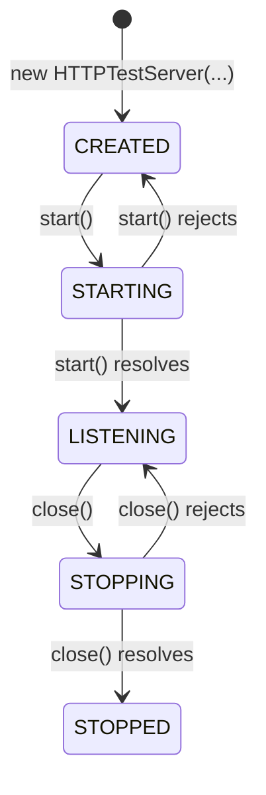

# HTTP Test Server

[](https://opensource.org/licenses/MIT)

The `http-test-server` module provides a simple HTTP test server. It is designed to help developers test HTTP clients by simulating various server behaviors and responses. The server supports different routes that can trigger specific behaviors such as silent rejections, timeouts, and large file responses. It also includes error handling and logging features to assist in debugging and testing.

## Table of Contents

- [Installation](#installation)
- [Usage](#usage)
  - [Using the `HTTPTestServer` Class](#using-the-httptestserver-class)
  - [Using the HTTP Test Server Start-Up Facility](#using-the-http-test-server-start-up-facility)
- [HTTP Test Server Routes (URLs)](#http-test-server-routes-urls)
  - [`/silentrejection`](#silentrejection)
  - [`/silenttimeout`](#silenttimeout)
  - [`/noisyrejection`](#noisyrejection)
  - [`/noisytimeout`](#noisytimeout)
  - [`/bigrandomfile`](#bigrandomfile)
  - [`/checkpattern`](#checkpattern)
  - [`/checkstring`](#checkstring)
  - [`/checkjson`](#checkjson)
  - [`/silentresponse`](#silentresponse)
  - [`/stop`](#stop)
  - [`/` or any other route](#or-any-other-route)
- [Modifying the Defaults](#modifying-the-defaults)
- [HTTP Test Server States](#http-test-server-states)
- [The `HTTPTestServer` Class](#the-httptestserver-class)
  - [Static Properties](#static-properties)
  - [Instance Properties](#instance-properties)
  - [Instance Methods](#instance-methods)
    - [`constructor()`](#constructor)
    - [`start()`](#start)
    - [`stop()`](#stop)
- [Testing](#testing)
- [Contributing](#contributing)
- [License](#license)

## What is New

### Version 0.4.0

- `SimpleTimer` is now an ES6 module. This provides better support for tools like ESLint 9 and a cleaner code syntax.
- Updated the minimum Node.js engine version required to 20.

### Version 0.3.0

- Added the `/checkjson` route.

### Version 0.2.0

- Added the `serverPort` property to the `HTTPTestServer` class for consistency with the constructor options.
- Deprecated the `port` property of the `HTTPTestServer` class.

### Version 0.1.0

- Intial release.

## Installation

You can install this module via `npm`:

```shell
npm install @jfabello/http-test-server
```

## Usage

To use the `http-test-server` module, you can import it into your code and then create an instance of the `HTTPTestServer` class, or you can use the HTTP Test Server start-up facility.

### Using the `HTTPTestServer` Class

```javascript
import { HTTPTestServer } from "@jfabello/http-test-server";

async function someAsyncFunction() {
	// Create a new HTTP Test Server instance
	let httpServerInstance = new HTTPTestServer({ serverHost: "127.0.0.1", serverPort: 8080 });

	// Start the server
	try {
		await httpServerInstance.start();
	} catch (error) {
		console.error("Error starting HTTP Test Server: ", error);
	}
}

someAsyncFunction();
```

After the HTTP Test Server starts, you can stop it by calling the `stop()` method or by requesting the `/stop` route.

### Using the HTTP Test Server Start-Up Facility

First, clone the HTTP Test Server repository with the following command:

```shell
git clone https://github.com/jfabello/http-test-server.git
```

Then, navigate to the project directory and install the npm dependencies:

```shell
cd http-test-server
npm install
```

Finally, start the HTTP Test Server using the following command:

```shell
npm start
```

You can stop the server by requesting the `/stop` route.

## HTTP Test Server Routes (URLs)

The HTTP Test Server provides several routes to test different server behaviors and responses. The following is a list of the available routes:

### `/silentrejection`

This route immediately destroys the connection without sending any response to the client. It is useful for testing how clients handle abrupt disconnections.

### `/silenttimeout`

This route sets a timer to destroy the connection after a specified timeout period without sending any response. It helps in testing client behavior when the server becomes unresponsive. The default timeout is 1 second.

### `/noisyrejection`

This route sends periodic chunks of data to the client and then destroys the connection. It is designed to test how clients handle incomplete data streams and abrupt disconnections. The default is to send chunks every 10 milliseconds and destroy the connection after 100 milliseconds.

### `/noisytimeout`

This route sends periodic chunks of data to the client and then destroys the request after a specified timeout period. It is useful for testing client behavior when the server becomes unresponsive after partially sending data. The default is to send chunks every 10 milliseconds and stop after 100 milliseconds, meanwhile a timeout of 1 second was set when the server started responding, when this timer expires the connection is destroyed.

### `/bigrandomfile`

This route sends a large file with random data as the response. It is useful for testing how clients handle large file downloads and manage memory during the process. The default file size is 500 MB.

### `/checkpattern`

This route checks if the request body matches a predefined pattern. If the pattern matches, it sends the pattern back; otherwise, it sends a 400 HTTP status code. It is useful for testing if the client is sending the correct HTTP request method, the correct `Content-Type` header, and handling binary data correctly. The default pattern is the string `"This is a pattern!"` (without the double quotes) in UTF-8 encoding repeated until it fills a 2 MB binary buffer. Please note that the buffer size is 2 MB as in 2 * 1000 * 1000 bytes.

This route requires that the HTTP request method is set to `POST`, and the `Content-Type` header is set to `application/octet-stream`.

### `/checkstring`

This route checks if the request body matches a predefined string pattern. If the string matches, it sends the pattern back; otherwise, it sends a 400 HTTP status code. It is useful for testing if the client is handling plain text data correctly. The default pattern is the string `"This is a pattern!"` in UTF-8 encoding repeated 10,000 times.

This route requires that the HTTP request method is set to `POST`, and the `Content-Type` header is set to `text/plain`.

### `/checkjson`

This route checks if the request body matches a predefined JSON object. If the JSON object matches, it sends the object back, perhaps with properties in a different order; otherwise, it sends a 400 HTTP status code. It is useful for testing if the client is handling and converting JSON data correctly.

This is the default JSON object:

```json
{
	"firstName": "John",
	"lastName": "Doe",
	"age": 25,
	"address": {
		"street": "Somewhere",
		"city": "Anytown",
		"state": "CA",
		"zip": 12345
	},
	"isActive": true
}
```

This route requires that the HTTP request method is set to `POST`, and the `Content-Type` header is set to `application/json`.

### `/silentresponse`

This route sends a `204 No Content` HTTP status code response to the client. It is useful for testing how clients handle responses with no content.

### `/stop`

This route sends an HTML page indicating that the server is stopping and then stops the server. It is useful for gracefully shutting down the server after tests are performed.

### `/` or any other route

This route sends an HTML welcome page as the response. It serves as the default route and can be used to verify that the server is running and accessible.

## Modifying the Defaults

To modify the values that the HTTP Test Server uses as defaults, modify the `defaults.js` file in the `src` directory.

## HTTP Test Server States

The `HTTPTestServer` class provides the following states:



## The `HTTPTestServer` Class

### Static Properties

- `CREATED`: Read-only property representing the `CREATED` server state.
- `STARTING`: Read-only property representing the `STARTING` server state.
- `STARTED`: Read-only property representing the `STARTED` server state.
- `STOPPING`: Read-only property representing the `STOPPING` server state.
- `STOPPED`: Read-only property representing the `STOPPED` server state.
- `errors`: Read-only property that contains the HTTP Test Server error classes as properties.

### Instance Properties

- `state`: The state of the HTTP Test Server instance.
- `serverPort`: The port of the HTTP Test Server instance.

### Instance Methods

#### `constructor()`

Creates a new instance of the HTTP Test Server.

##### Parameters

- `options`: The HTTP Test Server configuration options object (optional).
	- `serverHost`: The HTTP Test Server host. The default is `127.0.0.1`.
	- `serverPort`: The HTTP Test Server port. The default is `8080`.

##### Throws

- `ERROR_HTTP_TEST_SERVER_HOST_TYPE_INVALID`: If the HTTP Test Server host argument type is not a string.
- `ERROR_HTTP_TEST_SERVER_HOST_INVALID`: If the HTTP Test Server host argument is not an IPv4 address, a hostname, or a fully qualified domain name (FQDN).
- `ERROR_HTTP_TEST_SERVER_PORT_TYPE_INVALID`: If the HTTP Test Server port argument is not an integer.
- `ERROR_HTTP_TEST_SERVER_PORT_OUT_OF_BOUNDS`: If the HTTP Test Server port argument is not between 0 and 65535.

#### `start()`

Starts the HTTP Test Server instance. If the server is in the `STARTING` or `LISTENING` states, it returns the existing promise.

##### Returns

A promise that resolves to `HTTPTestServer.LISTENING` if the HTTP Test Server starts successfully, or rejects to an error if the HTTP Test Server start fails.

##### Throws

- `ERROR_HTTP_TEST_SERVER_NOT_IN_STARTABLE_STATE`: If the HTTP Test Server is not in a state where it is possible to start it up.

This instance method can also throw a POSIX error if the server fails to start.

#### `stop()`

Stops the HTTP Test Server instance. If the server is already in the `STOPPING` or `STOPPED` states, it returns the existing stop promise.

##### Returns

A promise that resolves to `HTTPTestServer.STOPPED` if the HTTP Test Server stops successfully, or rejects to an error if the HTTP Test Server stop fails.

##### Throws

- `ERROR_HTTP_TEST_SERVER_NOT_IN_STOPPABLE_STATE`: If the HTTP Test Server is not in a state where it is possible to stop it.

This instance method can also throw a POSIX error if the server fails to stop.

## Testing

To run the tests for this module, first clone the repository using the following command:

```shell
git clone https://github.com/jfabello/http-test-server.git
```

Then, navigate to the project directory and install the npm dependencies, this will install the Jest testing framework:

```shell
cd http-test-server
npm install
```

Finally, run the tests using the following command:

```shell
npm test
```

## Contributing

Unfortunately, we are not able to accept contributions at this time.

If you find a bug in the code, please open an issue.

Thank you for your understanding.

## License

This project is licensed under the MIT License. See the [LICENSE](LICENSE) file for details.
